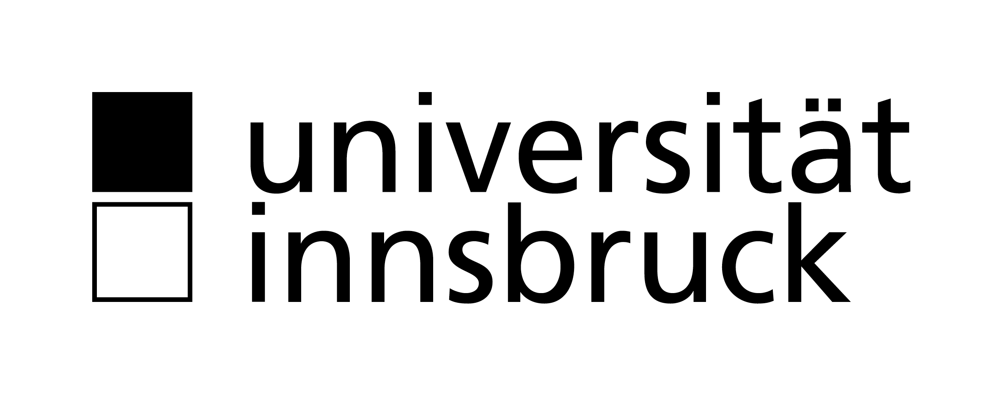
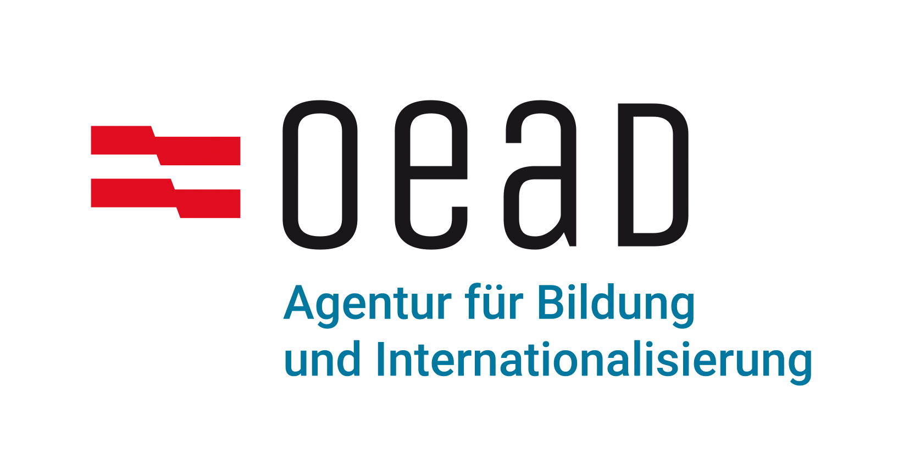
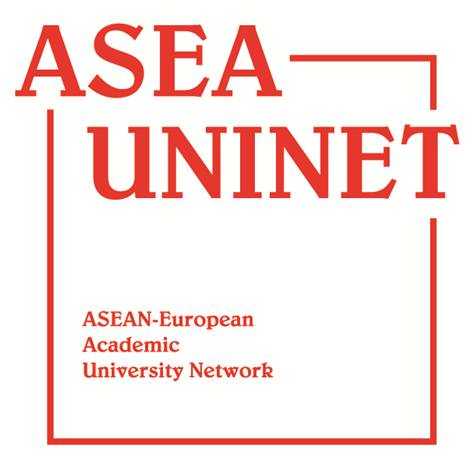
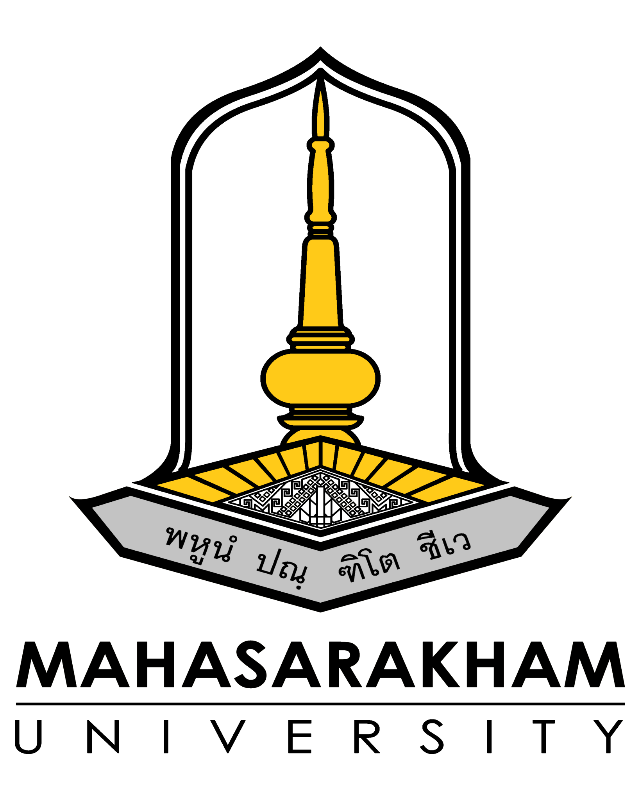

  <h2>Funding</h2>

<figure style="text-align:center">
  
  <figcaption>
    
University of Innsbruck, Austria  
    Early Stage Funding 2021
    

  </figcaption>
</figure> 

 

<figure style="text-align:center">
  
  <figcaption>OeAD – Agency for Education and Internationalisation</figcaption>
</figure>

 

<figure style="text-align:center">
  
  <figcaption>ASEA Uninet</figcaption>
</figure> 

 

  <h2>Partners</h2>

<figure style="text-align:center">
  
  <figcaption>Maha Sarakham University</figcaption>
</figure> 

 

  <h2>Acknowledgements</h2>

People that contributed to past an current projects on Frass4Gas: Julia Rothärmel, Julian Dedieu, Nazlican Yalcin, Andreas Wagner, Dirk Benndorf, Robert Heyer, Carina D. Heussler, Siripuk Suraporn, Heribert Insam, Maria Payr, Nico Peer, Thomas Klammsteiner.
