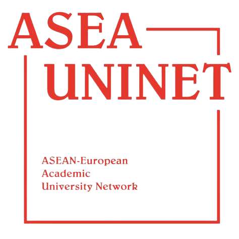

<br/>
<body>
  <div class="formatted">

Using insect frass as a co-substrate in anaerobic digestion holds promising potential for sustainable waste management and renewable energy production. Insect frass, a mixture of excrements, substrate residues, shed skins, and dead insects, is rich in organic matter and nutrients, making it an ideal candidate for anaerobic digestion. By co-digesting insect frass with other organic waste materials, such as agricultural residues or food waste, the overall performance and efficiency of the anaerobic digestion process can be enhanced. Insect frass can act as a valuable source of carbon and nutrients, increasing the biogas yield and improving the stability of the anaerobic digestion system. Furthermore, the inclusion of insect frass in the co-substrate can help divert organic waste from landfills, reducing greenhouse gas emissions and promoting circular economy principles. The resulting biogas generated from this process can be used for electricity generation, heat production, or even as a vehicle fuel, contributing to the transition towards a more sustainable and resource-efficient future.


This website summarizes a series of lab-scale experiments investigating the suitability of insect frass as co-substrate in anaerobic digestion of cattle slurry and provides additional supplementary material. The experiments were conducted fat the Department of Microbiology, University of Innsbruck.

<br/>

<div class="boxed">

### **Frass4Gas - Pre-treatment of industrial insect breeding residues for anaerobic digestion.** 
#### *Funded by: Early Stage Funding, University of Innsbruck.*

The aim of this project was to assess the potential of ensilaged frass as co-substrate for anaerobic digestion of cattle slurry, and to investigate the impact of lactic acid fermentation on the microbiota of black soldier fly frass (residue substrate mainly consisting of larval skins, excretions, and undigested residues). Thereby, we will combine three processes strongly influenced by microbial activity: (I) frass production, which is highly connected to microbes residing in larval guts, (II) ensilaging, which is driven by the metabolism of lactic acid bacteria, and (III) anaerobic digestion, where an interactive consortium of anaerobic microbes converts organic wastes into biogas.

**Contributing people**: Nazlican Yalçın, Julia Rothärmel, Dirk Benndorf, Robert Heyer, Andreas O. Wagner  

<br/>

**Funded by**:  

<div>
  <a href="https://www.uibk.ac.at"></a>
</div>  

</div>
    
<br/>
<br/>

<div class="boxed">

### **Frass4Gas - Thailand.** 
#### *Funded by ASEA-UNINET and OeAD.*

For this cooperative project, we aimed to investigate the suitability of silkworm (*Bombyx mori*), cricket (*Acheta domesticus*), black soldier fly (*Hermetia illucens*) and mealworm (*Tenebrio molitor*) frass as co-substrate for anaerobic digestion. Anaerobic digestion is a widespread technology to convert low-value organic wastes to biogas and fertilizer (digestate). During the digestion process, the complex interactions of microbial communities and the exclusion of oxygen contribute to the hygienisation of the input substrate, thereby greatly improving the biological safety of organic wastes. Several pre-trials at our lab have shown that the co-digestion of frass from black soldier fly larvae can increase overall biogas yields from cattle manure. To expand this area of research, we plan to explore frass from insect species that are intensively farmed in Thailand (e.g., silkworms and crickets) as co-substrates for anaerobic digestion. 

**Contributing people**: Siripuk Suraporn, Maria Payr

<br/>

**Funded by**:  

<div>
  <a href="https://oead.at/"></a>
  <a href="https://asea-uninet.org/"></a>
</div>

</div>

<br/>
<br/>

### Scientific output

**Publications**:  

1. Klammsteiner, T. Yalcin, N., Rothärmel, J., Heyer, R., Benndorf, D., Wagner, A.O., Insam,H., Hupfauf, S., 2023. In-depth insights into biotic and abiotic dynamics of using insect frass as co-substrate for anaerobic digestion and biogas production. *In preparation*.  
[https:/doi.org/](https:/doi.org/)  

1. Hupfauf, S., Dedieu, J., Rothärmel, J., Wagner, A.O., Insam, H., Klammsteiner, T., 2023. Storage time affects the frass microbiota but does not change its biogas potential. *In preparation*.  
[https:/doi.org/](https:/doi.org/)


**Presentations**:  

1. Klammsteiner, T., Insam, H., Hupfauf, S. Frass-tastic additive: Exploring the value of insect frass in anaerobic digestion. Presented at the ISAM2023 – 12th International Symposium on Anaerobic Microbiology, Innsbruck, Austria, 23.-26. May 2023.  

1. Klammsteiner, T., Yalçın, N., Insam, H., Hupfauf, S. Frass to gas: industrial insect rearing residues as co-substrates for anaerobic digestion. Presented at the Insecta2021 International Conference, Magdeburg, Germany, 8.-9. September 2021.  

  </div>
</body>


```{css echo=F}

.formatted {
  text-align: justify;
  text-justify: auto;
} 

.boxed {
  background: #F3F5F6;
  padding-top: 10px;
  padding-right: 10px;
  padding-bottom: 1px;
  padding-left: 10px;
  text-align: left;
}
```
