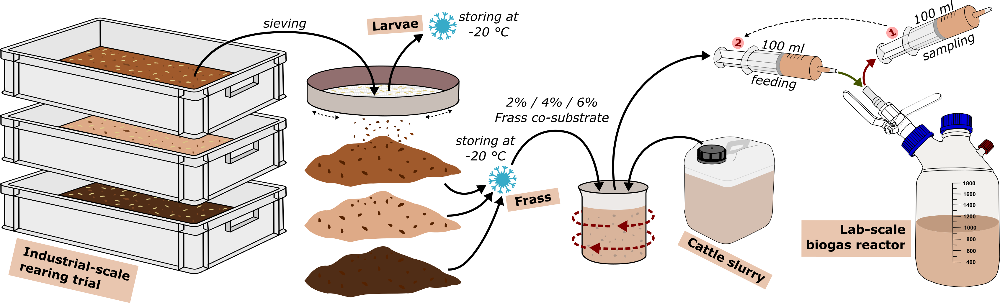

<br/>

<b>Citation:</b>
<div class="boxed">
Klammsteiner, T.<sup>†</sup>, Yalcin, N., Rothärmel, J., Benndorf, D., Wagner, A.O., Insam,H., Hupfauf, S.<sup>†</sup>, 2023. In-depth insights into biotic and abiotic dynamics of using insect frass as co-substrate for anaerobic digestion and biogas production. *Submitted*. (<sup>†</sup>equal contribution)  
[https:/doi.org/](https:/doi.org/)
</div>

<br/>

## About

Lorem ipsum dolor sit amet, consectetur adipiscing elit, sed do eiusmod tempor incididunt ut labore et dolore magna aliqua. Elit eget gravida cum sociis natoque penatibus et magnis. In tellus integer feugiat scelerisque varius morbi enim nunc. Vel risus commodo viverra maecenas accumsan lacus vel facilisis volutpat. Suspendisse ultrices gravida dictum fusce ut placerat orci nulla. Morbi tristique senectus et netus et. Vitae purus faucibus ornare suspendisse sed nisi lacus sed viverra. Elit ullamcorper dignissim cras tincidunt lobortis feugiat vivamus at. Congue quisque egestas diam in arcu cursus euismod. Feugiat nibh sed pulvinar proin gravida hendrerit lectus. Blandit aliquam etiam erat velit scelerisque. Blandit cursus risus at ultrices. Sed augue lacus viverra vitae.  

<br/>

<figure>
  
  <figcaption><b>Figure 1.</b> Co-substrates used in the anaerobic digestion experiments.</figcaption>
</figure>

<br/>

Lorem ipsum dolor sit amet, consectetur adipiscing elit, sed do eiusmod tempor incididunt ut labore et dolore magna aliqua. Elit eget gravida cum sociis natoque penatibus et magnis. In tellus integer feugiat scelerisque varius morbi enim nunc. Vel risus commodo viverra maecenas accumsan lacus vel facilisis volutpat. 

<br/>

<figure>
  
  <figcaption><b>Figure 2.</b> Overview on the general workflow of the experiment.</figcaption>
</figure>

<br/>

## Results

Lorem ipsum dolor sit amet, consectetur adipiscing elit, sed do eiusmod tempor incididunt ut labore et dolore magna aliqua. Elit eget gravida cum sociis natoque penatibus et magnis. In tellus integer feugiat scelerisque varius morbi enim nunc. Vel risus commodo viverra maecenas accumsan lacus vel facilisis volutpat. Suspendisse ultrices gravida dictum fusce ut placerat orci nulla. Morbi tristique senectus et netus et. Vitae purus faucibus ornare suspendisse sed nisi lacus sed viverra. Elit ullamcorper dignissim cras tincidunt lobortis feugiat vivamus at. Congue quisque egestas diam in arcu cursus euismod. Feugiat nibh sed pulvinar proin gravida hendrerit lectus. Blandit aliquam etiam erat velit scelerisque. Blandit cursus risus at ultrices. Sed augue lacus viverra vitae.


<br/>

### Abbreviations

- CS: Cattle slurry (control)
- WB: Fresh wheat bran/grain product mix
- WBF: Wheat bran/grain product mix digested by larvae (frass)
- CHF: Wheat bran/grain product mix amended with biochar and subsequently digested by larvae (frass)
- FEF: Wheat bran/grain product mix after lactic acid fermentation and subsequent digestion by larvae (frass)

<br/>

## Data availability

The data that support the findings of this study are openly available in the European Nucleotide Archive (ENA) at [https://www.ebi.ac.uk/ena/](https://www.ebi.ac.uk/ena/) under the accession number [PRJEB56626](https://www.ebi.ac.uk/ena/browser/view/PRJEB56626).


```{css echo=F}

.boxed {
  background: #F3F5F6;
  padding-top: 10px;
  padding-right: 10px;
  padding-bottom: 1px;
  padding-left: 10px;
  text-align: justify;
  text-justify: auto;
} 


```
